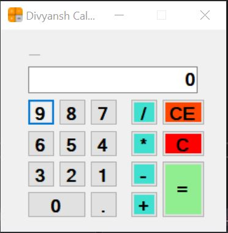
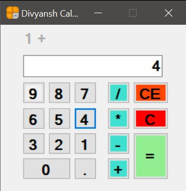
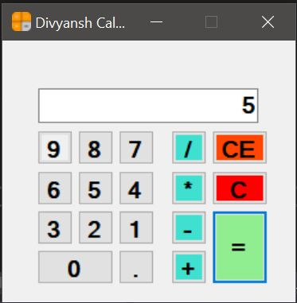

<h1 align="center"> SIMPLE GUI CALCULATOR </h1>

This is a Simple GUI Calculator with basic operations like add, substract, divide, multiply made using `Windows Form Application in C#` .

Below are some snapshots of this application.

